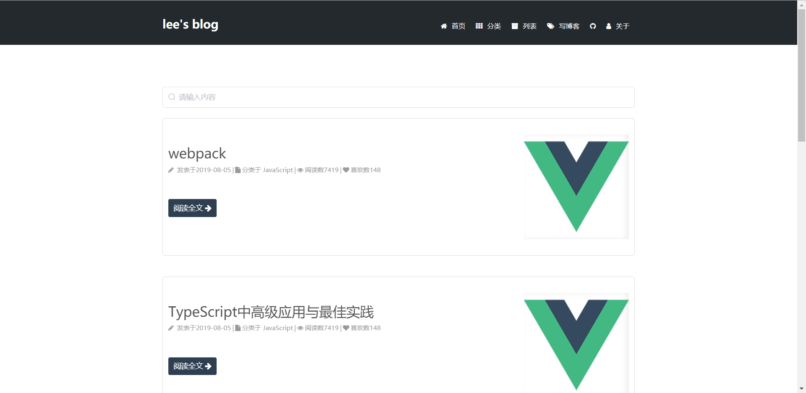
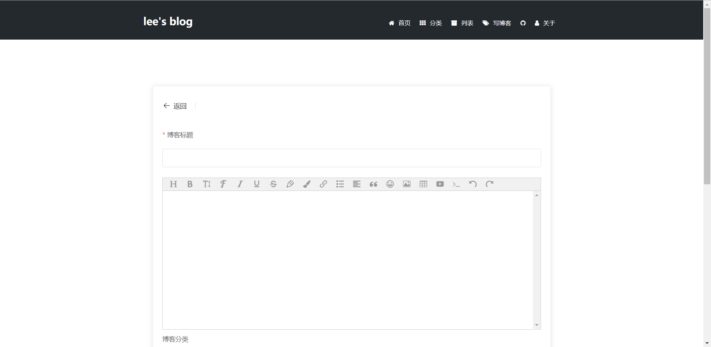
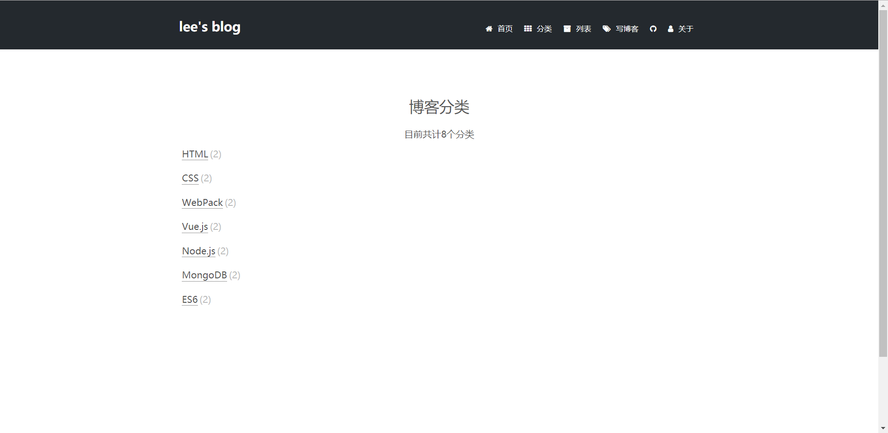

# 个人博客
项目使用vue开发前端，后端使用node.js + mongodb 搭建。编辑器使用[wangEditor](https://github.com/wangfupeng1988/wangEditor)
## 所用技术
    vue2.x + vue-router + axios + element-ui + node.js + mongodb

## 实现功能

* 新增博客  
* 删除博客 
* 编辑博客
* 个人信息页  
* 博客展示页
## 项目运行

```
<!-- 前端 -->
cd /client  => npm install   => npm run serve

<!-- 后端 -->
cd /server npm install   => node app.js


```

## 项目截图  

* 首页  
  
* 新增博客    
  
* 博客分类页  
